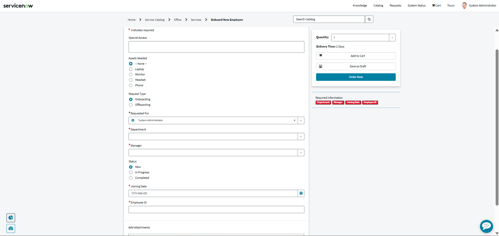
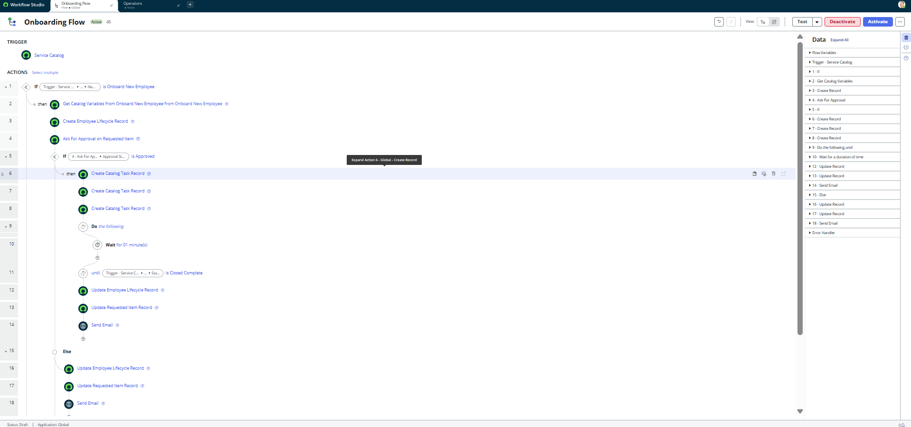
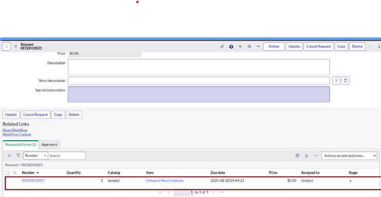

# 🚀 Automated Employee Onboarding & Offboarding System (ServiceNow)

## 📌 Project Overview

The **Automated Employee Onboarding & Offboarding System** is a ServiceNow-based solution designed to streamline and automate employee lifecycle processes.
It eliminates manual coordination by automating approvals, task assignments, and status tracking across departments such as IT, Facilities, and Security.

---

## 🎯 Objectives

* Automate onboarding and offboarding workflows
* Reduce manual intervention and delays
* Ensure proper coordination between departments
* Improve visibility and tracking of employee requests

---

## 🛠️ Technologies Used

* ServiceNow Platform
* Flow Designer
* Service Catalog
* Catalog UI Policies
* Custom Table (`Employee Lifecycle`)
* Email Notifications

---

## 🧩 System Architecture

The system consists of the following components:

1. **Service Catalog Item**

   * “Onboard New Employee”
   * Collects employee details such as:

     * Employee ID
     * Manager
     * Department
     * Joining Date / Exit Date
     * Assets Required / Assets to Collect
     * Request Type (Onboarding / Offboarding)

2. **Catalog UI Policies**

   * Dynamically show/hide fields based on request type
   * Enforce mandatory fields

3. **Flow Designer**

   * Automates the entire workflow:

     * Trigger → Approval → Task Creation → Completion → Notification

4. **Custom Table**

   * Stores lifecycle data (`Employee Lifecycle`)

---

## ⚙️ Workflow Explanation

### 🔹 Step 1: Trigger

* Flow starts when a user submits a catalog request

### 🔹 Step 2: Get Catalog Variables

* Fetch user input values from the form

### 🔹 Step 3: Create Lifecycle Record

* Insert record into `Employee Lifecycle` table

### 🔹 Step 4: Approval Process

* Approval sent to Manager (dynamic reference)

---

### ✅ If Approved:

#### 🔸 Task Creation

* IT Task → Account setup & hardware
* Facilities Task → Workspace preparation
* Security Task → ID & access provisioning

#### 🔸 Wait Condition

* Flow waits until all tasks are marked **Closed Complete**

#### 🔸 Completion

* Update Lifecycle Status → Completed
* Update RITM → Closed Complete
* Send completion email

---

### ❌ If Rejected:

* Update status → Rejected
* Send rejection email to requester

---

## 🔄 End-to-End Flow

User submits request
→ Manager approval
→ Tasks assigned to departments
→ Tasks completed
→ System updates status
→ Notification sent

---

## 📸 Screenshots

(Add your screenshots in the `docs/screenshots` folder and link them below)

Example:

---

## 💡 Key Features

* Fully automated workflow
* Dynamic approval system
* Multi-department task coordination
* Real-time tracking via RITM
* Reduced manual errors
* Scalable and maintainable

---

## ⚠️ Challenges & Solutions

| Challenge               | Solution                              |
| ----------------------- | ------------------------------------- |
| Flow not triggering     | Linked flow in Catalog Process Engine |
| Approval not generating | Configured correct approval rules     |
| Wait condition issue    | Used loop until tasks completed       |
| UI policy conflicts     | Separated conditions properly         |

---

## 📈 Business Impact

* Reduced onboarding time
* Improved operational efficiency
* Better task tracking
* Increased process reliability

---

## 🚀 Future Enhancements

* Integration with Active Directory
* Role-based access automation
* Dashboard for HR analytics
* Mobile notifications

---

## 👤 Author

**Harindra C**
Final Year Computer Science Student
BITM Ballari

---

## ⭐ Conclusion

This project demonstrates how ServiceNow can be used to automate complex business workflows efficiently, improving productivity and reducing operational overhead.
